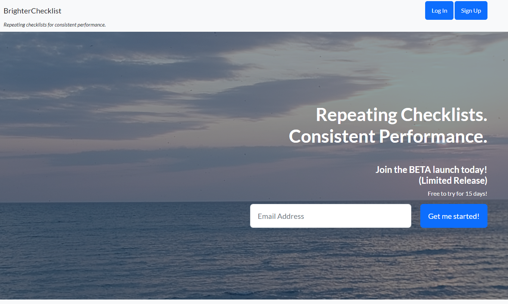
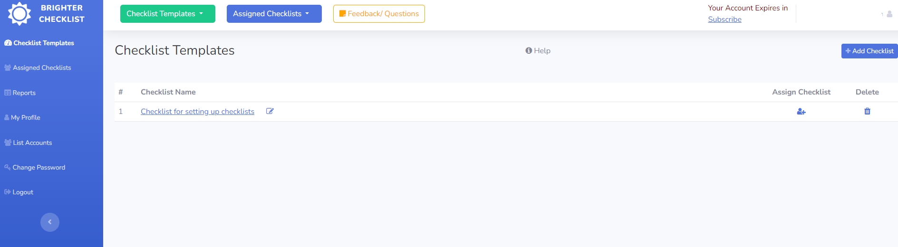
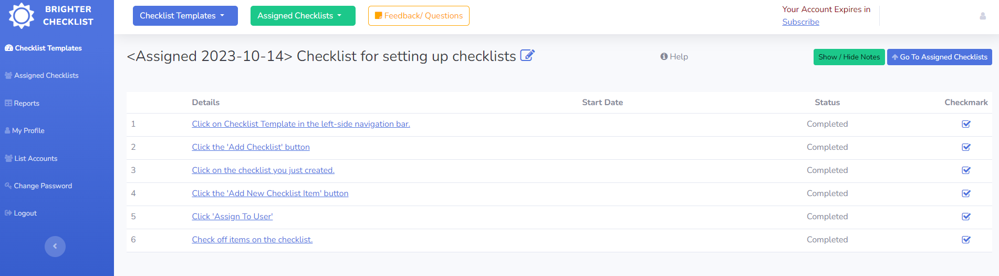

# Brigher Checklist

**Repetative Checklists so that you know that things are done the right way every time.**

A Compliance Checklist SAAS application. 

## Why?
I write this applicattion to see if I could: 
1. Write a complete SAAS application that included: 
    * An on-boarding process
    * Included a trial-period for users who signed up
    * Included payment
2. Provided a useful application that could be used in a variety of businesses. 
3. Make a true product-led growth product.

## Project Outcome
I hit all of my goals for development with this project.  
I didn't acquire customers though. My next project will have to focus on the marketing side a lot more. 

## Pictures
Here's a few screenshots

## Technology
* Python
* Django
* PostgreSQL
* Javascript
* SendGrid (Mail)
* Stripe (Payments)
* Digital Ocean (Hosting) (VM)
